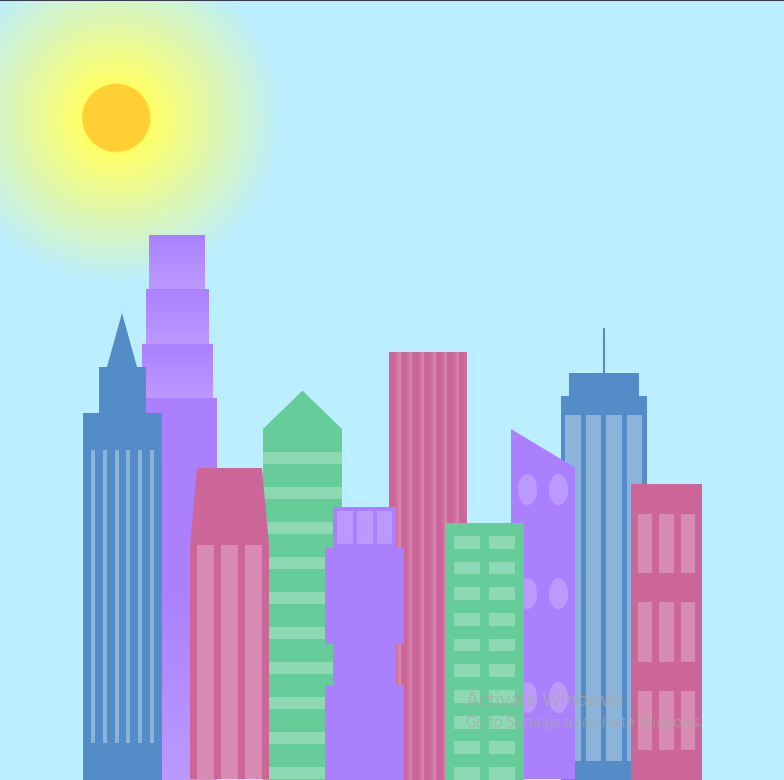

# Learn CSS Variable by Building a City Skyline

The task list link is [FreeCampCode a Balance Sheet](https://www.freecodecamp.org/learn/2022/responsive-web-design/learn-css-variables-by-building-a-city-skyline/step-1)

The task screen shot;

## More than 1000px

## Less 1000px

